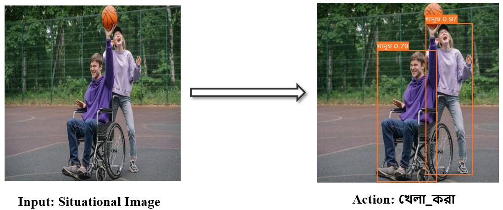
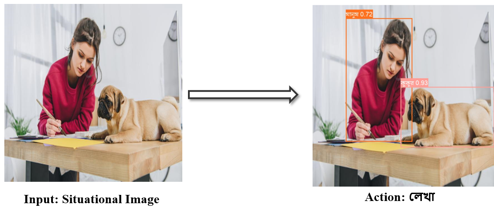
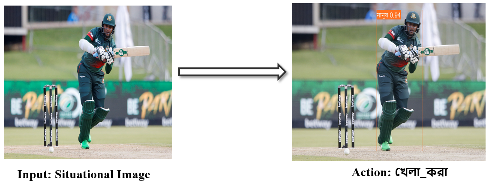

# Activity Recognition and Agent Detection


## Overview

This project explores the fascinating domain of activity recognition and agent detection from situational images, specifically targeting the burgeoning field of single-image activity recognition.

## Key Features

- **Single-Image Activity Recognition**: Detects and identifies activities from a single input image.
- **Agent Detection**: Recognizes and labels individuals involved in the detected activities.
- **Bengali Language Support**: Labels and activities are recognized and displayed in Bengali.

## Example

In the example shown in Figure 1, the left side displays the input situational image. This image captures two individuals engaged in an activity: one person is sitting in a wheelchair and playing with a basketball, while the other stands behind, appearing to assist or engage with the basketball.



The right side of this figure illustrates the model's output. The model processes the input image to detect and identify the activity and the agents involved. Bounding boxes are drawn around the individuals, correctly identifying and labeling them as "মানুষ" (human), with confidence scores of 0.79 and 0.97, respectively. Additionally, the model accurately recognizes the activity as "খেলা করা" (playing) from the input image.

### Additional Examples

Here are two more instances demonstrating the model's capabilities:





---

## Installation

To get started with this project, follow these steps:

```bash
git clone [https://github.com/Raihan-004/Action-with-Agent.git]
cd Action-with-Agent
pip install -r requirements.txt
